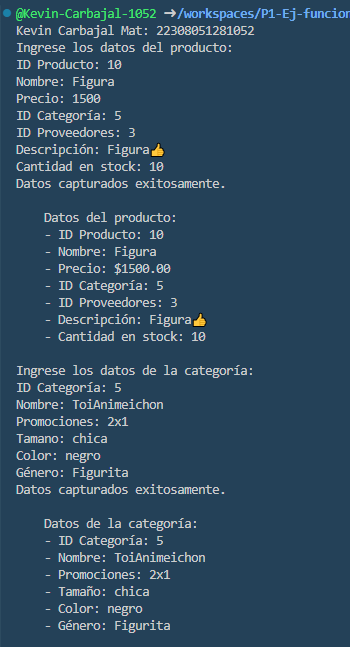
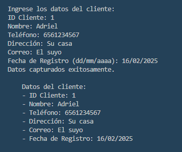

* crear una clase productos con atributos (idProducto, nombre, precio, idCategoria, idProveedores, Descripcion, cant_stock), una funcion captura datos() y otra mostrar datos (), crear instancia y utilizarlos atributos y llamadas a funciones lenguaje dart.
* crear una clase Categoria con atributos (idCategoria, nombre, promociones, Tamaño, color, genero, ), una funcion captura datos() y otra mostrar datos (), crear instancia y utilizarlos atributos y llamadas a funciones haciendo que el usuario ingrese datos lenguaje dart.
* crear una clase Clientes con atributos (idClietes, nombre, Telefono, Direccion, Correo, fechaDeRegistro, ), una funcion captura datos() y otra mostrar datos (), crear instancia y utilizarlos atributos y llamadas a funciones haciendo que el usuario ingrese datos lenguaje dart.
* 
* 