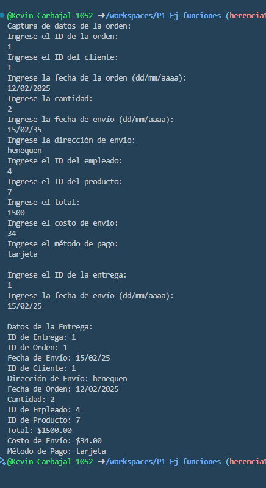

* Crear la clase Ordees con los atributos (idOrdenes, idClientes, fechaOrden, cantidad,FechadeEnvio, DireccionEnvio,idEmpleado, idProducto, Total, CostoEnvio, MetodoPago) con una funcion captura datos(), con interaccion de interfaz de usuario. crear la clase Entregas(idEntregas, idOrdenes, FechaEnvio, idClientes, Direccion) y una funcion mostrar datos(). lenguaje dart
* 